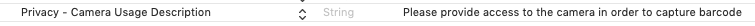
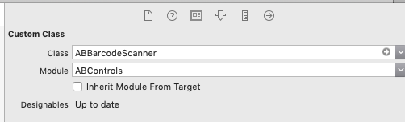
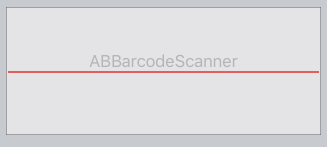

# ABControls

The ABControls project's purpose is to provide various iOS controls within
 a reusable framework.
In the decade I've been writing iOS apps for clients I've written dozens of
 custom UI elements - from special labels to barcode readers, to signature 
 capture elements.  I thought, why not take some of the things I've learned
 in this time and put together some UI controls that would both speed my 
 development and more importantly hopefully help others to learn how to create
  their own controls.
---
All of the controls support **@IBDesignable** and **@IBInspectable** - so they will render within InterfaceBuilder.  All objects inherit from UIView.    To use, simply drop a UIView on your viewcontroller.view in IB, change the  owner to ABControls and the class to the type of ABControl you'd like to use
#### Current List of Implemented Controls:
**ABBarcodeScanner** - Allows for scanning barcodes of various types.  Inner class ABBarCode allows for creating a barcode image

**ABCheckBox** - A simple checkbox control

**ABDropDown** - A dropdown control.  

**ABImageViewer** - Allows for specifying an array of UIImage objects, displays them in a scrollable image list and allows for selecting on to Be diaplayed/selected

**ABListBox** - exactly what you expect it to be

**ABSignatureCapture** - Allows for capture a touch drawn signature - returns as data, an image or a bezierpath

**ABTouchDraw** - Similar to ABSignatureCapture -- allows for simple drawing with return data as an image.  Very nasic, plenty of room for enhancement

Additionally, I have created some placeholder classes for controls I plan to implement in the near future.
## Installation
ABControls are compatible with [Carthage](https://github.com/Carthage/Carthage)
and can be easily added to your application. ABControls supports generation
of static frameworks using Carthage 0.30.0 or newer, or ABControls can be
used as a dynamic framework. To install ABControls into your project using
Carthage, add the following line to your `Cartfile`:
    github "albebaubles/ABControls"
Next, run the following command from your terminal:
    carthage update
This command will build the `ABControls` and `ABControls-Static` schemes.
After being built, you can find the dynamic framework at
`Carthage/Build/iOS/ABControls.framework` and the static framework at
`Carthage/Build/iOS/Static/ABControls.framework`.
Please note when using the static framework that you do not need to copy
the static framework into the application bundle like you do with dynamic
frameworks.
Thank you!  All feedback welcome.

## Usage
### ABBarcodeScanner
You must be sure to add a camera usage description to your project's plist, otherwise you will not
be able to scan a barcode. 

Next step is to drop a UIView object onto your view, and change the class type to ABBarcodeScanner

Now your view should indicate it's a barcode scanner 

Now all that is left to do is wire the delegate, set the allowed barcode types 
(default is all == nil) and you are off and running.  Note the camera turns on
immediately for this control.  No implementation for turning it off/on exists at this time.
    @IBOutlet weak private var barcodeScanner : ABBarcodeScanner!
    barcodeScanner.delegate = self
    
 func didReceiveBarcode(_ code : ABBarCode) {
        NSLog("code value \(code.data)")
        NSLog("code type \(code.type)")
    }
To create a barcode image its as simple as
    let barcodeImage = ABBarCode("CICode128BarcodeGenerator", "01171811182118061-05").image()### ABCheckBox
